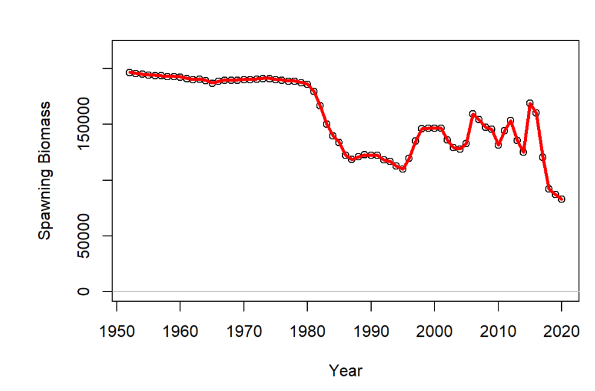
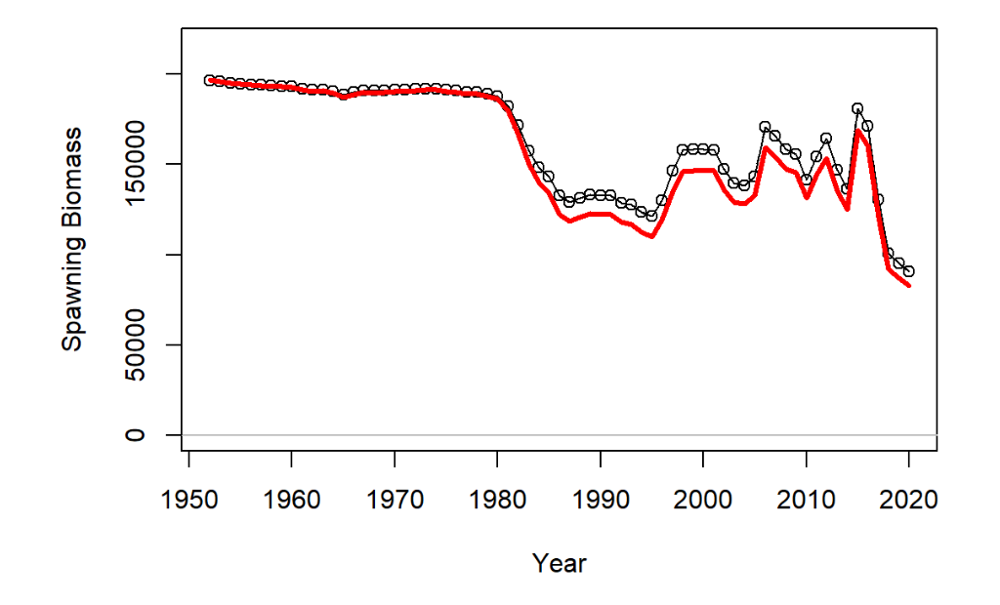

```{r knitr_options, include=FALSE}
knitr::opts_chunk$set(echo = TRUE)
```

# Introduction

This document describes a review of the code for the WSJK MSE and provides some comments for potential issues and suggestions for how to address them.

The MSE code reviewed here is from the GitHub repository: <https://github.com/rodrigosantana/ICCAT_WSKJ_MSE>

I have forked the repository and the code for this document is available here: <https://github.com/AdrianHordyk/ICCAT_WSKJ_MSE/tree/main>. This repository also includes some other modified OMs and results, but much of those were exploratory and may not correspond with the workflow and code included in this document.

## General Overview

The code and workflow developed for the WSKJ are excellent: very well structured and include help comments throughout.

The main recommendations of this review are:

1.  **Ensure that the OMs reproduce the SS3 dynamics** Importing SS3 output into OMs is a complex process, because the structure of the SS3 output does not always remain consistent. The previous OMs did not match the SS3 dynamics exactly. This is almost certainly caused by the `openMSE` code used to import the SS3 output. This issue has been fixed in the development version of `MSEtool` now.

2.  **Select or Develop an Index to use in the MPs** If an index (and other data such as catches) are not provided to the OM via `OM@cpars$Data` feature, the data will be generated from the observation model. The problem with this approach is that the MPs in the closed-loop simulation testing will be using simulated historical catch and historical index, rather than the actual observed data. The main thing here is to identify the index that will be used when the selected MP is implemented in the fishery (or generate a single index from the available indices), and add that to the OM so that the MPs in the MSE use the same index as they will if applied in reality to the actual fishery data.

3.  **Add the Observed Historical Data to the OMs** Once an index is selected (or developed), create a `Data` object and add that index, together with the historical catches, and any other data that will be used by the MPs. Any data that is used by an MP that is not included in the real fishery `Data` object, will be simulated within the MSE framework from the observation model (currently set to be quite favorable). Once the `Data` object is ready, add it to the OMs via cpars.

4.  **Modify MPs with Required Specifications** If there is likely to be a data lag beyond the default 1-year, or a management cycle greater than every year, the MP code will need to be modified to include those. I've included examples below. Also, the MSE projection period begins in 2021. If there are observed catch data for the years before the MPs will be implemented in reality (e.g. 2025), the MP code should be modified to include those fixed catch levels. I've included examples below.

# Setup

If we are to compare code and outputs, it's important that the same package versions are used. This code uses the latest development versions of the `openMSE` package and the `SWOMSE` package (North Atlantic Swordfish MSE).

Many of the general functions developed in the `SWOMSE` package will in time be added to the `MSEtool` package.

## Install Latest Package Development Versions

```{r install_packages, message=FALSE, warning=FALSE}

# `pak` package used to install packages quickly and easily:

# install.packages('pak')

# Install latest development versions of `openMSE` package:

# pak::pkg_install('blue-matter/MSEtool')
# pak::pkg_install('blue-matter/SAMtool')
# pak::pkg_install('blue-matter/openMSE')
# pak::pkg_install('ICCAT/nswo-mse')
```

## Package Versions

```{r package_versions}

packageVersion('MSEtool') 
packageVersion('SAMtool')
packageVersion('openMSE') 
packageVersion('SWOMSE') 

```

# Generating OMs

## OM Specifications

```{r OM_specs, message=FALSE, warning=FALSE}
library(openMSE)   
# OM specifications:  
nsim <- 100  
proyears <- 40  
interval <- 3  
Obs <- MSEtool::Precise_Unbiased  
Imp <- MSEtool::Perfect_Imp 
```

> **Note**:
>
> The `Obs` object `MSEtool::Precise_Unbiased` means that any data that are not provided in a `Data` object in `OM@cpars` will be simulated with very little observation error.
>
> Need to ensure that any data used in MPs (e.g., index/indices, catch, life-history parameters) are provided in a `Data` object via `OM@cpars`. Otherwise those data will be simulated from the `Obs` object: `MSEtool::Precise_Unbiased`, andwill be much more favorable than is likely in reality.
>
> More on this below.

## SS3 Output Files

```{r SS_path, include=FALSE}
SS_file_path <- "G:/Shared drives/BM shared/1. Projects/TOF Advisory/WSKJ_MSE_Assistance/SS_files"
```

```{r SS_dirs}
# SS_file_path <- "PATH/TO/SS3_Files"

SS_dirs <- c("WSKJ_EstRec93_Qnt25_h6", 
             "WSKJ_EstRec93_Qnt50_h6", 
             "WSKJ_EstRec93_Qnt75_h6",
             "WSKJ_EstRec93_Qnt25_h7", 
             "WSKJ_EstRec93_Qnt50_h7", 
             "WSKJ_EstRec93_Qnt75_h7",
             "WSKJ_EstRec93_Qnt25_h8", 
             "WSKJ_EstRec93_Qnt50_h8", 
             "WSKJ_EstRec93_Qnt75_h8")
```

## Historical Fishery Data to be added to OM

Extracting data from SS3 output from the first SS3 model to add to the OMs.

```{r load_data, message=FALSE, warning=FALSE}
## Extract data from first SS3 model ##
data <- SS2Data(file.path(SS_file_path, SS_dirs[1]))
```

Create a new `Data` object to pass to the OMs:

```{r create_data}
WSKJ_Data <- new('Data')
```

> **Note**:
>
> The specific data to include in the OM depends on what data are used by the MPs. Here I'm assuming the MPs use observed catches and an index of abundance. If the MPs use other data, such a life-history information, or age/length composition, these data should be added to the `Data` object in the OM.
>
> The main point here is that the MPs should use the same historical data (and assumed parameters) as those that will be used when the MP is implemented in reality.

Populate the `Data` object with historical catches:

```{r add_catch, fig.height=6, fig.width=6}
WSKJ_Data@Year <- data@Year
WSKJ_Data@Cat <- data@Cat
WSKJ_Data@CV_Cat <- data@CV_Cat # fixed at 0.2 and may not be used in MPs

```

Explore indices used in SS3 models:

```{r plot_indices, fig.height=6, fig.width=8, message=FALSE, warning=FALSE}
get_unit <- function(Iunit) {
  Iunit <- as.character(Iunit)
  unlist(lapply(Iunit, function(i)
    switch(i, '0'='Number', '1'='Biomass')
    )
  )
}

index_names <- dimnames(data@AddInd)[[2]]
index_units <- get_unit(data@AddIunits)
index_values <- data@AddInd[1,,]
n.ind <- length(index_names)

indices <- data.frame(Year=rep(data@Year, each=n.ind),
                      Value=as.vector(index_values),
                      Name=as.character(index_names),
                      Unit=index_units)

library(ggplot2)
ggplot(indices, aes(x=Year, y=Value, color=Unit)) +
  facet_wrap(~Name, ncol=3) +
  geom_line(linewidth=1.2) +
  theme_bw()

```

> **Note**:
>
> Need to select an index (or generate a single index from the indices) to pass to the OM. This index will be used in the closed-loop forward projections in the MSE, and will be the same index that is used when the MP is implemented in reality.

The selection of an index to use in the MPs is an important decision. Here I'm choosing the PS_West index, as it is the longest time-series and includes data up to the terminal year (2020). This can be changed by modifying the code below.

Populate the Index slot in the `Data` object:

```{r add_index}
ind <- which(index_names == 'PS_West')
# add the PS_West index to the `Ind` slot (used by the MPs)
WSKJ_Data@Ind <- array(data@AddInd[1,ind,], 
                       dim=c(1, length(WSKJ_Data@Year)))

# add the CV 
WSKJ_Data@CV_Ind <- array(data@CV_AddInd[1,ind,], dim=dim(WSKJ_Data@Ind))

```

The `Data` object currently contains only the historical catches and the PS_West index:

```{r plot_data, fig.height=3, fig.width=6, message=FALSE, warning=FALSE}
plot(WSKJ_Data, wait=F)
```

## Create OMs from SS3 Output

### Base Case OMs

This loop imports the SS3 models into OM objects, adds the `WSKJ_Data` object in cpars, and saves in a list:

```{r import_OMs, message=FALSE, warning=FALSE, cache=TRUE}
OM_list <- vector('list', length(SS_dirs)*3)

# import SS3 OMs
for (i in seq_along(SS_dirs)) {
  ssdir <- file.path(SS_file_path, SS_dirs[i])
  name <-  SS_dirs[i]
  om <- SS2OM(ssdir, nsim=nsim, proyears=proyears, interval = interval,
              Obs=Obs, Imp=Imp, Name=name)

  # add data
  om@cpars$Data <- WSKJ_Data
  OM_list[[i]] <- om
  rm(om)
}

```

### Additional OMs - Implementation Error

Populate the `om@TACFrac` slot with the systematic overage in catch.

10% overage in TAC:

```{r overage_10}
for (i in 10:18) {
  om_match <- i %% 9
  if (om_match==0) om_match <- 9
  om <- OM_list[[om_match]]
  om@TACFrac<-c(1.1,1.1)
  om@Name = paste0(om@Name,"_ImpErr_10%")
  OM_list[[i]] <- om
}

```

20% overage in TAC:

```{r overage_20}
for (i in 19:27) {
  om_match <- i %% 9
  if (om_match==0) om_match <- 9
  om <- OM_list[[om_match]]
  om@TACFrac <-c(1.2,1.2)
  om@Name = paste0(om@Name,"_ImpErr_20%")
  OM_list[[i]] <- om
}

```

## Save `OM_list` to Disk

```{r save_OMs, eval=TRUE}
saveRDS(OM_list, file.path('00_OMs', "SS3_OMs_03_2024.rds"))
```

## Compare OMs with SS3 Models

Compare the fishery dynamics of the imported OM with those in the corresponding SS3 output. The OM should reproduce the fishery dynamics reported in the SS3 model.

```{r plot_OMs, message=FALSE, warning=FALSE, cache=TRUE}
OM_number <- 1 # 
om <- OM_list[[OM_number]]
om@nsim <- 2 # reduce sims for plotting


plot_SS2OM(om, file.path(SS_file_path, SS_dirs[OM_number]), 
           open_file = FALSE,
           dir=getwd(),
           filename=paste0('OM', OM_number))
```

Output File: `OM1.html`

```{r image1, fig.cap='Spawning stock biomass from SS3 (red) and OM (black points) from OM generated in this script', echo=FALSE}

```

> **Note**: All OMs are generated with the same process, so if one OM is correct the others should be as well. But may be worth checking for some others.

#### Compare previous OMs

The previous OM did not reproduce the SS3 dynamics exactly (different F, biomass, and catch values)

This was most likely caused by some issues in the SS3 importing by the `openMSE` functions (this has been fixed now in `openMSE` packages)

```{r previous_OMs, message=FALSE, warning=FALSE, cache=TRUE}
OM_number <- 1 # 
previous_OM_list <- readRDS('00_OMs/SS_Operating_models_v01_fullgrid_13082022.rds')
om <- previous_OM_list[[OM_number]]
om@nsim <- 2 # reduce sims for plotting

plot_SS2OM(om, file.path(SS_file_path, SS_dirs[OM_number]), 
           open_file = FALSE,
           dir=getwd(),
           filename=paste0('previous_OM', OM_number))
```

Output File: `previous_OM1.html`

```{r image2, fig.cap='Spawning stock biomass from SS3 (red) and OM (black points) from previously generated OM', echo=FALSE}

```

## Other Notes:

### Fixed Catches for 2021 and 2022

```{r}
# 2021 and 2022 observed catch 
obs_catches <- c(20048.21, 21377.24)
```

> **Note**: it's not clear if these are currently implemented in the MPs?

# Management Procedures

## MP Code

The script 'script_simulate_OMs_ver00.R' specifies the following MPs to include in the MSE:

```{r MPnames, message=FALSE, warning=FALSE}
MPs <- c("NFref", "curE", 
         "CC_15kt", "CC_20kt", "CC_25kt", "CC_30kt", "CC_35kt", "CC_40kt",
         "GB_slope", "Iratio", "Islope1",
         "SCA_100_40_SBMSY", "SP_100_40_SBMSY", "SPSS_100_40_SBMSY",
         "SP_03", "SP_04", "SP_05", "SP_06")

source("2.0 script_prepare_MPs_ver00.R")
```

The first two MPs `NFref` and `curE` are No Fishing and Current Effort MPs from the `openMSE` packages, and are used for reference.

### Fixed TAC MPs

MPs 3 – 8 are constant catch MPs, that set the TAC at a constant level for all projection years:

```{r CC_15kt}
CC_15kt

# TAC in first projection year
CC_15kt(1, WSKJ_Data)
```

These MPs do not use data. These MPs do not have fixed catches/TAC for the initial projection years (see section below).

### DLMtool Index-based MPs

MPs 9 - 11 `GB_slope`, `Iratio`, and `Islope1` are MPs from the `DLMtool` package. These MP all use catch and index data (`Data@Cat`, `Data@Ind`, and `Data@CV_Ind`).

These MPs do not have a data lag currently coded into them, and do not have fixed catches/TAC for the initial projection years.

```{r GB_slope}
# TAC in first projection year
GB_slope(1, WSKJ_Data, reps=1)
```

### SAMtool Model-based MPs

MPs 12 – 18 are custom model-based MPs that use assessment models from the `SAMtool` package.

#### SCA-based MP

`SCA_100_40_SBMSY` uses the statistical catch-at-age assessment model from the `SAMtool` package (`SAMtool::SCA`).

This MP requires a lot of data and parameter values that are not currently specified in the `WSKJ_Data` object (e.g., life-history information (*M*, *Linf*, etc, and catch-at-age data).

Because of this MP will not work with the current `WSKJ_Data` object:

```{r, SCA, error=TRUE}
SCA_100_40_SBMSY(1, WSKJ_Data)
```

But it ***will*** run within the MSE because the life-history information and catch-at-age composition data will be simulated within the model (assuming optimistic observation error).

Also, the life-history information (e.g., steepness) in the simulated Data will be OM specific, i.e., it will change to match the steepness value specified in the OM. In reality, if this MP was to be applied, the steepness value and other life-history parameters would have to be fixed at specific values.

It is not a problem to run the SCA-based MP in the MSE, but important to note in the interpretation of the results that this MP requires data in addition to catch and index, and those data are (currently) included in the MSE.

#### Surplus Production-based MPs

`SP_100_40_SBMSY` and `SPSS_100_40_SBMSY` are both surplus production models and require only historical catches and an index of abundance. These MPs currently do not have a data lag coded into them, and do not have fixed catches/TAC for the initial projection years.

`SP_03`, `SP_04`, `SP_05`, and `SP_06` also use a surplus production model, with a custom harvest control rule. The main difference between these MPs is the value of the tuning parameter and the type of surplus production model that is used. These MPs currently do not have a data lag coded into them, and do not have fixed catches/TAC for the initial projection years.

## Notes on MPs

### Fixing TAC in Initial Projection Years

As noted in previous section, it is not clear if the 'TAC' in the first two projection years (2021 and 2022) should be fixed to the observed catch level?

If so, the 2023 and 2024 'TAC' values should also be fixed at the observed (or assumed) catch and the MP begin in 2025 (assuming that is the year when the TAC will first be implemented with the selected MP.

Here is an example of the `CC_15kt` MP with TAC fixed for 2021 and 2022, using the `SWOMSE::FixedTAC` function:

```{r fixed_TAC_example}

# create the Catchdf data.frame (must have this structure for `FixedTAC to work`)

Catchdf <- data.frame(Year=2021:2022,
                      Catch=c(20048.21, 21377.24))

CC_15kt_MOD <- function(x, Data, ...) {
  Rec <- new("Rec")
  data_year <- max(Data@Year) # TAC will be set for data_year+1
  # ie data_year will be 2020 in projection year 2021
  
  if (data_year <= max(Catchdf$Year)) {
    # fixed TAC
    Rec <- SWOMSE::FixedTAC(Rec, Data)
    return(Rec)
  }
  
  # Rest of MP code goes here
  Rec@TAC <- rep(1.5e4, reps)
  
  Rec
}
class(CC_15kt_MOD) <- 'MP'

CC_15kt_MOD(1, WSKJ_Data)
```

The `Catchdf` object must be available in the global environment for it to be used within the MPs (and must be exported to the cores if the MSE is run in parallel).

### Data Lags

Currently only the `SP_` MPs appear to have a data lag built-into them. This may not be a problem if those MPs are the main candidates that are being proposed for management. If other MPs such as `Iratio` are being evaluated as candidates for adoption, a wrapper function needs to be created to add both the fixed catch and the data lag so that these MPs are comparable with the others.

Here's a example for `Iratio` wiith a `Data_Lag` argument added:

```{r Iratio}
Iratio_MOD <- function(x, Data, Data_Lag=1, ...) {
  Rec <- new("Rec")
  data_year <- max(Data@Year) # TAC will be set for data_year+1
  # ie data_year will be 2020 in projection year 2021
  
  if (data_year <= max(Catchdf$Year)) {
    # fixed TAC
    Rec <- SWOMSE::FixedTAC(Rec, Data)
    return(Rec)
  }
  
  ## Lag Data
  Data <- Lag_Data(Data, Data_Lag)
  ## Applied Iration MP to lagged data
  Rec@TAC <- Iratio(x, Data, reps=1)
  Rec
}
class(Iratio_MOD) <- 'MP'

```

> **Note**:
>
> `Data_Lag = 1` means that if a TAC is being set for year y, data will be available up to year y-2
>
> e.g., when setting a TAC for 2021, it will use data up to 2019

### Management Interval 

As far as I can see, currently the MPs are applied and the TACs updated every year. If the TAC is not intended to be updated every year, the MP code needs to be modified to keep the TAC constant in the years between management cycles.

Here is an updated example of the `Iratio` MP that includes both the data lag and a management interval:

```{r}

Initial_MP_Yr <- 2023 # assuming MPs are first implemented after 2022
# ie maximum year in Catchdf

Iratio_MOD2 <- function(x, Data, Data_Lag=1, Interval=3, ...) {
  Rec <- new("Rec")
  if (SWOMSE::SameTAC(Initial_MP_Yr, Interval, Data)) {
    Rec@TAC <- Data@MPrec[x] # sets next TAC to previous TAC
    # use actual catches if they are available
    Rec <- SWOMSE::FixedTAC(Rec, Data) 
    return(Rec)
  }
  
  ## Lag Data
  Data <- Lag_Data(Data, Data_Lag)
  ## Applied Iration MP to lagged data
  Rec@TAC <- Iratio(x, Data, reps=1)
  Rec
}
class(Iratio_MOD2) <- 'MP'

```

> **Note**:
>
> The `SWOMSE::SameTAC` function requires `Initial_MP_Yr` set in the global environment and `Interval` either set as an argument to the MP or fixed as a global variable.
>
> If it is not a management update year, the TAC will remain the same as the previous TAC.

### Tuning MPs

Some of the MPs have a tuning parameter, but it does not appear that all the MPs have been tuned to a common target. Tuning is a time-consuming process, especially if there are multiple tuning targets.

My recommendation would be to tune the candidate MPs to achieve the highest long-term yields across either a single reference OM, or a set of reference OMs. MPs can then be compared across other performance metrics (e.g., sustainability metrics) and if they fail to provide satisfactory performance they can either modified internally (i.e., MP development by modifying the rules) or removed from the analysis.

Once you're satisfied with the OMs and the candidate MPs to include in the MSE, I can work with you to set up this performance tuning using the code and workflow I developed for the NSWO MSE process.

# Simulate OMs and run MSEs

The code for simulating the historical fisheries from the OMs and running the closed loop simulations all looks great.

## Number of Projection Years

My only recommendation concerns this line `MSE <- Sub(MSE, years = 1:33)`.

Currently the OMs are set for 40 projection years, and the last historical year is 202. This means the projection years will be:

```{r projection_years}
Pro_Years <- seq(OM_list[[1]]@CurrentYr+1, 
                 by=1, length.out=OM_list[[1]]@proyears)
Pro_Years
```

The line `MSE <- Sub(MSE, years = 1:33)` will remove the last 7 years of the projection period.

```{r dropyears}
Pro_Years[1:33]
```

If this final projection year is intended to be 2053, it will be more efficient to set `OM@pyears <- 33`

## Parallel Mode

If the MSE is going to be run in parallel mode, the global variables that are used within the MPs must be exported to the cluster. This can be done with `snowfall::sfExport()`. It may be less prone to errors and almost as efficient to turn off parallel mode.

# Performance Metrics

I haven't reviewed the PM code in detail, but it looks fine to me. Once the MSE results are ready, the PM code can be examined in more detail if needed.
